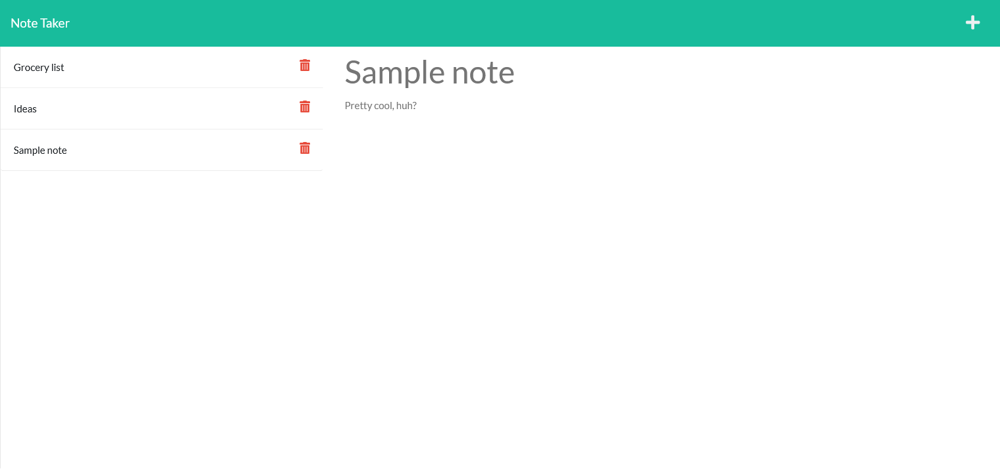

# note-taker

## Description
An application white allows for writing and saving notes. Notes are saved onto a JSON database, from which they can be deleted as well.

[Github Source Repository](https://github.com/byampols/note-taker).

## Table of Contents
1. [Usage](#usage)
2. [License](#license)
3. [Contributors](#contributors)
4. [Questions](#questions)

## Usage

* Open the page and press "Get Started" to be redirected to the notes page.
* Type a title and a description for your note.
* Press the save button at the top right to save your note.
* To view a note again, click it in the sidebar.
* To delete a note, press the trash can next to that note.

## License

[MIT License](https://opensource.org/licenses/MIT).

## Contributors
* Ben Yampolsky, server code
* [coding-boot-camp, base code](https://github.com/coding-boot-camp/miniature-eureka/blob/main/Develop/db/db.json)
* [adamhalasz, uniqid](https://www.npmjs.com/package/uniqid)

## Questions
### [My github profile.](https://github.com/byampols)
### [Email me if you have any questions!](byampols@alumni.cmu.edu)